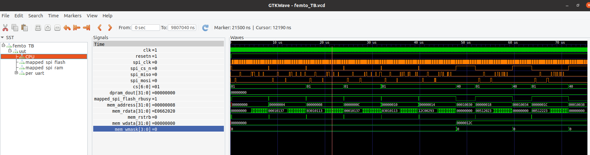
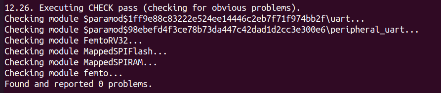
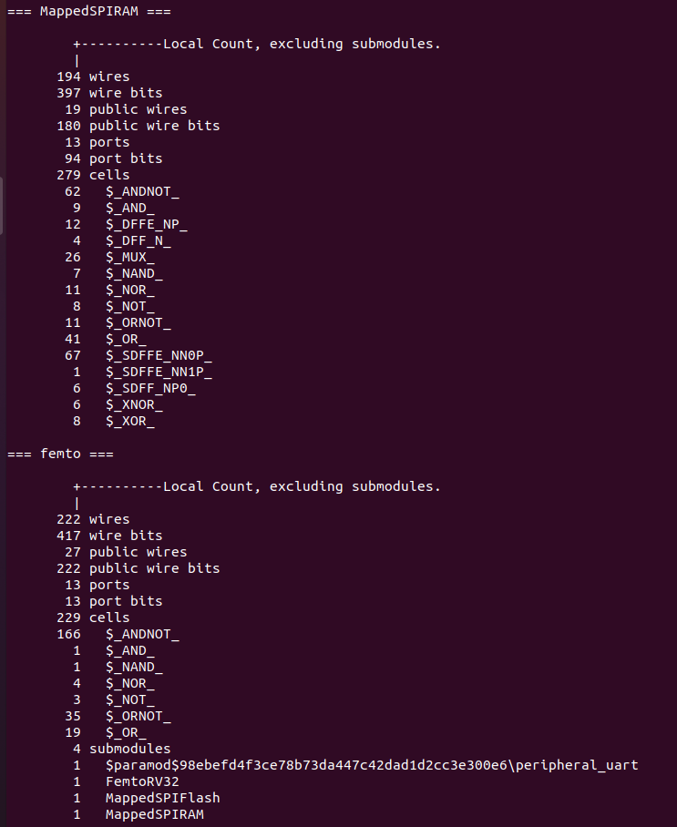
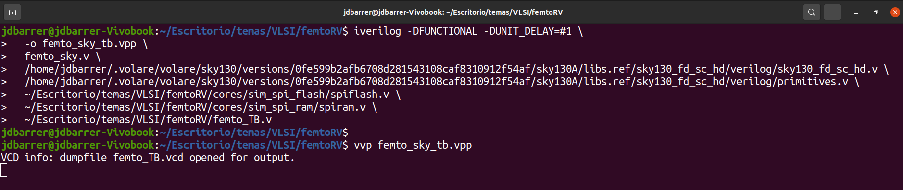
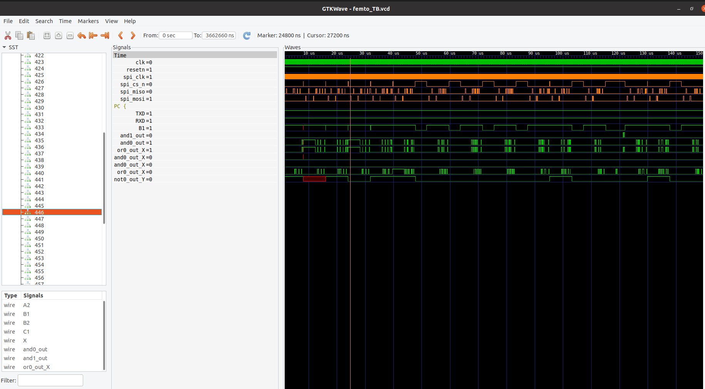

# 1️⃣ Simulación  
## Generación de VCD y visualización (Icarus Verilog y GTKWave)

### Introducción
El propósito de esta primera simulación es verificar la correcta integración de los módulos del procesador **FemtoRV** junto con sus periféricos y memorias, generando un archivo de ondas (`.vcd`) que nos permita observar el comportamiento de las señales internas.  
Este flujo inicial asegura que el diseño RTL se compile sin errores y que podamos inspeccionar las transiciones de las señales en **GTKWave**, antes de avanzar hacia simulaciones post-síntesis.

---

### Comandos utilizados

#### ⚙️ Compilación con Icarus Verilog
```bash
iverilog -DFUNCTIONAL -DUNIT_DELAY=#1 \
  -o sim_femto.vpp \
  -s femto_TB \
  femto_TB.v \
  OpenLane/src/*.v \
  cores/sim_spi_flash/spiflash.v \
  cores/sim_spi_ram/spiram.v
```

- **`-DFUNCTIONAL`** → Usa modelos funcionales de librerías.  
- **`-DUNIT_DELAY=#1`** → Asigna un retardo unitario a las compuertas.  
- **`-o sim_femto.vpp`** → Nombre del ejecutable de simulación.  
- **`-s femto_TB`** → Define el testbench top-level.  
- **Archivos `.v`** → Incluyen:  
  - Diseño principal: `femto.v`  
  - CPU: `femtorv32_quark.v`  
  - Periféricos: `perip_uart.v`, `uart.v`  
  - Memorias: `MappedSPIRAM.v`, `MappedSPIFlash.v`  
  - Modelos de prueba: `spiflash.v`, `spiram.v`

Posterior a esto, se realiza la ejecución de la simulación, con:
```bash
vvp sim_femto.vpp
```
- Corre el binario generado por Icarus Verilog.
- Produce la salida de simulación y el archivo de ondas (`femto_TB.vcd`).

Por ultimo, con este comando se realiza la visualización de señales en GTKWave:
```bash
gtkwave femto_TB.vcd &
```
- Abre el archivo de ondas en GTKWave.
- Permite inspeccionar gráficamente las señales del diseño.
- El `&` lo ejecuta en segundo plano para no bloquear la terminal.
#### Visualización de señales del archivo .vcd generado:

<p align="center">
  
</p>

<p align="center"><em>Figura 1. Visaulización de señales en GTKWave</em></p>


En la imagen se observa la simulación utilizando *GTKWave*. Las señales listadas corresponden a diferentes módulos y buses de comunicación del procesador FemtoRV y su entorno de pruebas (testbench).

Las señales clave incluyen:

- **`clk`** y **`resetn`** →  Reloj principal y señal de reset del sistema.  
- **`spi_clk`, `spi_cs_n`, `spi_mosi`, `spi_miso`** → Interfaz SPI utilizada para la comunicación con memorias externas.  
- **`cs[6:0]`** →  Líneas de selección de chip para identificar dispositivos conectados.  
- **`mem_address[31:0]`** y **`mem_rdata[31:0]`** →  Dirección y datos de lectura en la memoria principal.  
- **`mem_wdata[31:0]`** y **`mem_wmask[3:0]`** →  Datos y máscara para escritura en memoria.  
- **`mapped_spi_flash_rbusy`** →  Estado de ocupación de la memoria flash SPI.  

Para validar el correcto funcionamiento antes de la síntesis, se deben comprobar los siguientes puntos:

1. El reloj oscila correctamente y el reset solo se activa al inicio.  
2. Existe actividad coherente en las señales de SPI y de memoria durante los accesos.  
3. Las direcciones y datos de memoria cambian conforme se ejecutan las instrucciones, sin valores indeterminados.  
4. Los resultados observados coinciden con los esperados del programa de prueba.  

Si estas condiciones se cumplen y las señales muestran la actividad esperada, el procesador está listo para la etapa de síntesis en hardware.

--- 

#  2️⃣ Síntesis 
## Síntesis con Yosys y Verificación

La síntesis es el proceso mediante el cual el código RTL en Verilog se transforma en una representación lógica optimizada, lista para ser mapeada a celdas estándar del PDK. En este flujo utilizamos **Yosys** como herramienta principal, que permite analizar el diseño, generar netlists intermedios y aplicar optimizaciones.    

### Comandos utilizados:
Primero se abre Yosys:

```bash
yosys
```
Posterior, se verifica que Yosys reconozca, los archivos .v:

```bash
read_verilog femto.v
```
Una vez verificada esta lectura, se procede a realizar la síntesis:

```bash
synth -top femto
```
Despues de recibir el mensaje de confirmación de que todo salió bien (Como se muestra en la imagen a continuación):
<p align="center">
  
</p>

<p align="center"><em>Figura 2. Salida exitosa de la síntesis en Yosys. </em></p>

Para ver el resumen del diseño se usa el comando `stat`, el cual muestra el número de celdas y flip-flops.

<p align="center">
  
</p>

<p align="center"><em>Figura 3. Resumen de la síntesis en Yosys</em></p>

En la anterior imagen se muestra una sección del reporte de síntesis generado por Yosys para el diseño de un procesador FemtoRV y sus módulos auxiliares. Este resumen enumera la cantidad de recursos lógicos utilizados por cada módulo, como wires (cables), ports (puertos), y cells (celdas lógicas). Por ejemplo, para el módulo MappedSPIRAM se detallan los recursos internos necesarios para la implementación de la memoria RAM conectada vía SPI, listando específicamente la cantidad de operadores lógicos, flip-flops y multiplexores utilizados. De manera similar, el módulo principal femto muestra sus propios recursos y, además, sus submódulos relacionados, como el núcleo FemtoRV32 y periféricos de comunicación.

Una vez completada la síntesis inicial, es necesario mapear los flip-flops y compuertas lógicas hacia las celdas estándar del PDK. Para eso se utilizan los siguientes comandos, que vinculan el diseño con la librería **sky130_fd_sc_hd**:

- `dfflibmap -liberty /home/jdbarrer/.volare/volare/sky130/versions/0fe599b2afb6708d281543108caf8310912f54af/sky130A/libs.ref/sky130_fd_sc_hd/lib/sky130_fd_sc_hd__tt_025C_1v80.lib`  
- `abc -liberty /home/jdbarrer/.volare/volare/sky130/versions/0fe599b2afb6708d281543108caf8310912f54af/sky130A/libs.ref/sky130_fd_sc_hd/lib/sky130_fd_sc_hd__tt_025C_1v80.lib`  

Estos pasos permiten que los flip-flops se asignen correctamente a las celdas disponibles y que el netlist sea optimizado en función de la librería seleccionada. Después de ejecutar ambos comandos, el diseño debe quedar completamente mapeado a las celdas estándar del PDK, mostrando en la salida de Yosys que los flip-flops fueron reemplazados por equivalentes de la librería y que la lógica combinacional fue optimizada con éxito.  

---

 # 3️⃣ Simulación funcional post-síntesis
Después de sintetizar nuestro diseño RTL con Yosys y obtener el netlist (`femto_sky.v`), es importante verificar que el comportamiento funcional se mantiene. Esta simulación post-síntesis se realiza a nivel de celdas estándar de la librería Sky130, lo que nos permite observar el diseño ya mapeado a compuertas lógicas y flip-flops reales.
 ### Comandos utilizados:
 
 ```bash
# 1. Síntesis con Yosys y copia del netlist
yosys -c scripts/yosys/synth.tcl
cp out.v femto_sky.v

# 2. Compilación con Icarus Verilog
iverilog -DFUNCTIONAL -DUNIT_DELAY=#1 \
  -o femto_sky_tb.vpp \
  femto_sky.v \
  /home/jdbarrer/.volare/volare/sky130/versions/0fe599b2afb6708d281543108caf8310912f54af/sky130A/libs.ref/sky130_fd_sc_hd/verilog/sky130_fd_sc_hd.v \
  /home/jdbarrer/.volare/volare/sky130/versions/0fe599b2afb6708d281543108caf8310912f54af/sky130A/libs.ref/sky130_fd_sc_hd/verilog/primitives.v \
  ~/Escritorio/temas/VLSI/femtoRV/cores/sim_spi_flash/spiflash.v \
  ~/Escritorio/temas/VLSI/femtoRV/cores/sim_spi_ram/spiram.v \
  ~/Escritorio/temas/VLSI/femtoRV/femto_TB.v

# 3. Ejecución de la simulación
vvp femto_sky_tb.vpp

# 4. Visualización de ondas en GTKWave
gtkwave femto_TB.vcd &
```
<p align="center">
  
</p>

<p align="center"><em>Figura 4. Salida esperada del bash, para la simulación post síntesis.</em></p>

Cada paso del flujo tiene un propósito específico: primero Yosys genera el netlist sintetizado (femto_sky.v) con celdas de la librería Sky130, luego Icarus Verilog compila ese netlist junto con los modelos funcionales (sky130_fd_sc_hd.v, primitives.v), los módulos de memoria simulada (spiflash.v, spiram.v) y tu banco de pruebas (femto_TB.v), después vvp ejecuta la simulación y finalmente GTKWave permite visualizar las señales en un archivo .vcd. La diferencia con la primera simulación que hicimos al comienzo es que allí trabajábamos directamente con el RTL, donde las señales y módulos eran más legibles y cercanos al código original, mientras que en la simulación post-síntesis se observa el diseño ya mapeado a compuertas lógicas y flip-flops de la librería, con nombres distintos y más detallados, lo que permite verificar que el comportamiento funcional se conserva tras la síntesis.

A continuación, se muestra una imagen de como cambian los nombres y las señales mapeadas en GTKWave:

<p align="center">
  
</p>

<p align="center"><em>Figura 5. Visualización de las señales de las celdas en GTKWave.</em></p>

---

## 4️⃣ Simulación del Multiplicador de 32 bits en Xyce

Para validar la correcta descripción del módulo de multiplicador de 32 bits, se realiza una simulación independiente utilizando **Xyce**, un simulador de circuitos SPICE orientado a alto rendimiento y paralelización.  

El multiplicador es un bloque fundamental dentro del procesador **Femto RISC-V**, ya que permite ejecutar operaciones aritméticas de mayor complejidad. Antes de integrarlo completamente en el flujo del procesador, es recomendable comprobar su comportamiento de manera aislada para garantizar que la lógica esté bien definida y que las señales se propaguen correctamente.

### Ejecución desde Bash

En este caso se definen las siguientes variables de entorno:  
- `TARGET=mult_32` → Nombre del módulo a simular (multiplicador de 32 bits).  
- `TOP=mult_32` → Módulo principal de la simulación.  
- `NPROC=4` → Número de procesos paralelos que se utilizarán para la ejecución con **MPI**.  

Los comandos de ejecución son los siguientes:

```bash
mpirun -np ${NPROC} Xyce ${TARGET}_TB.cir
python plot_${TARGET}.py
```
La función de los comandos anteriores es: 

- `mpirun -np ${NPROC} Xyce ${TARGET}_TB.cir` → Lanza la simulación del testbench (mult_32_TB.cir) en Xyce, distribuyendo la carga en 4 procesos paralelos para acelerar el cálculo.

- `python plot_${TARGET}.py`→ Ejecuta el script de post-procesamiento que genera las gráficas de salida, permitiendo visualizar las señales y confirmar que el multiplicador responde correctamente a los estímulos definidos en el testbench.

- ✅ Resultado esperado: Tras ejecutar estos comandos, se debe obtener la simulación completa del multiplicador de 32 bits, junto con las gráficas que muestran su comportamiento. Esto confirma que la descripción del módulo es correcta y que puede integrarse de manera confiable en el procesador Femto RISC-V, tal y como se muestra a continuación:
- 
... (En redacción, todavia) ....

---

## 5️⃣ Simulación del Multiplicador de 32 bits en Ngspice

... (En redacción, todavia) ....

---

## 6️⃣ Extracción Magic

... (En redacción, todavia) ....
